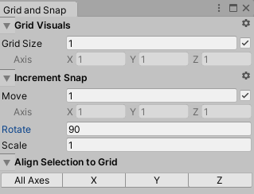
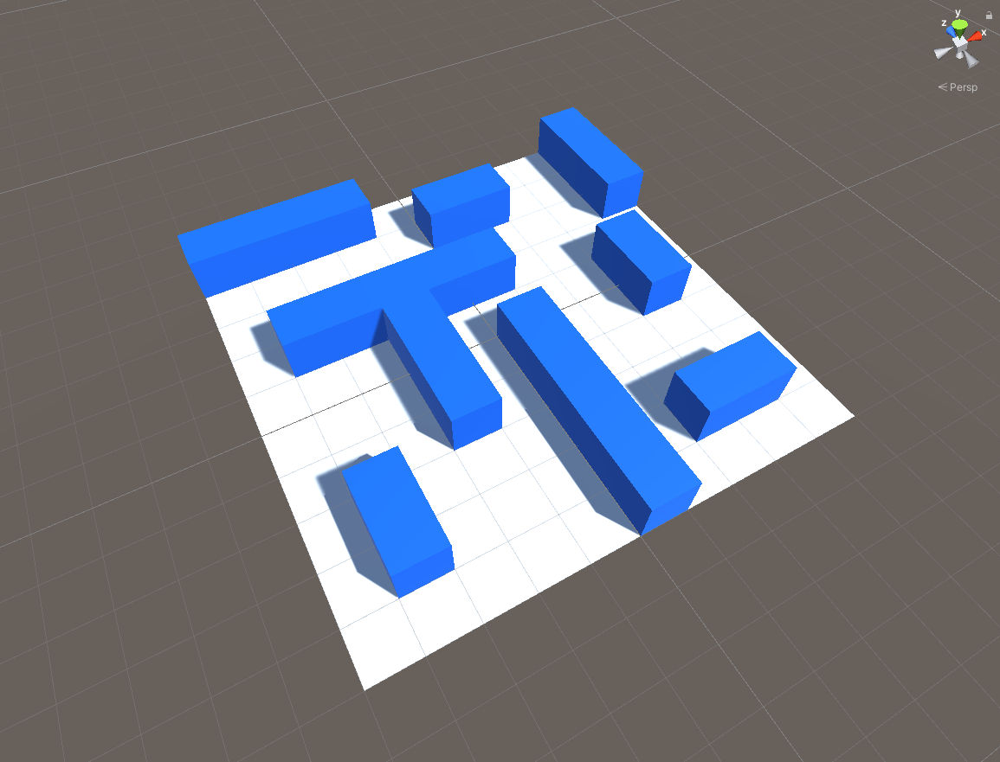
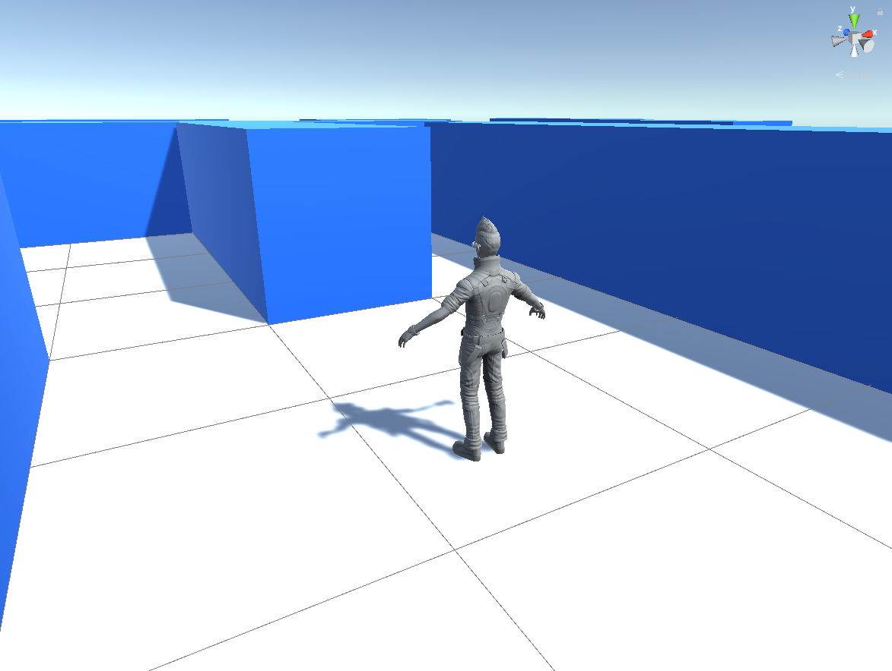
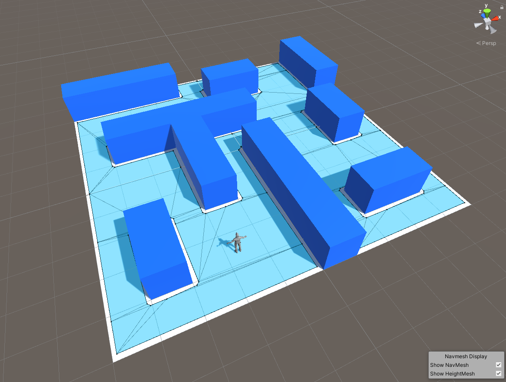
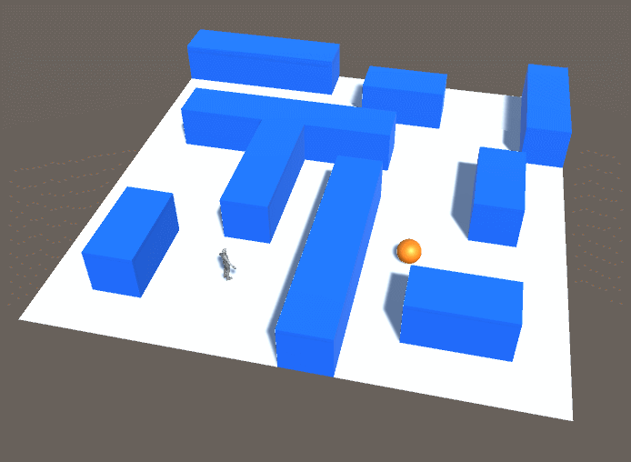
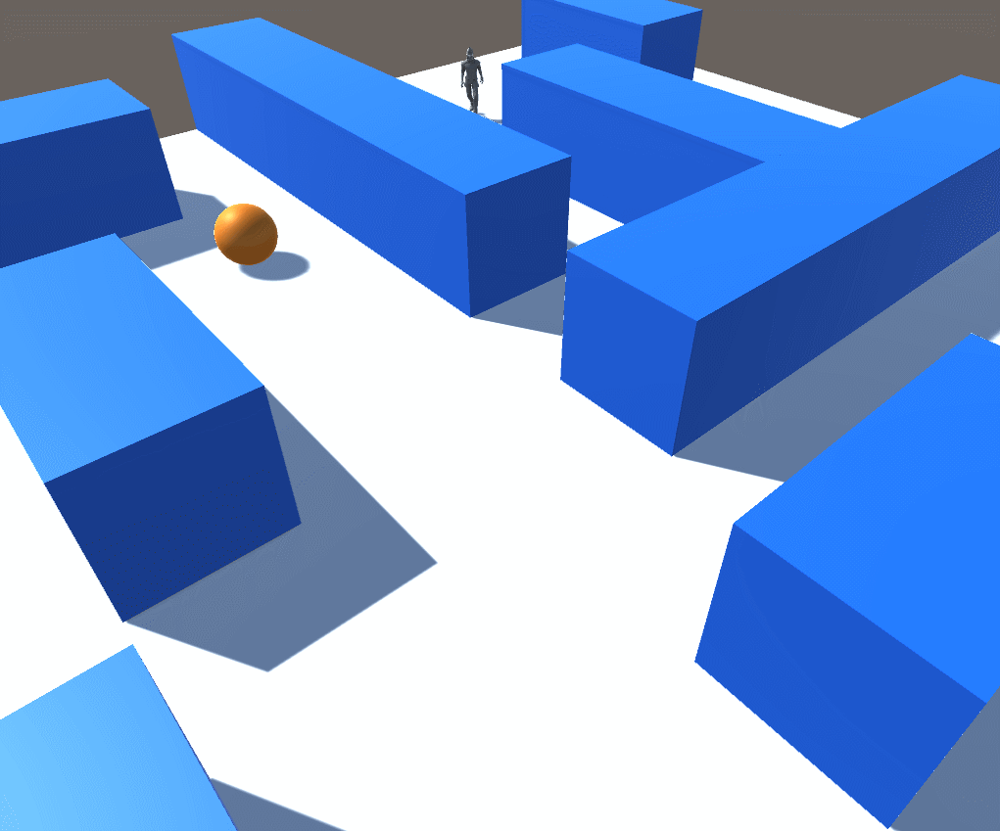
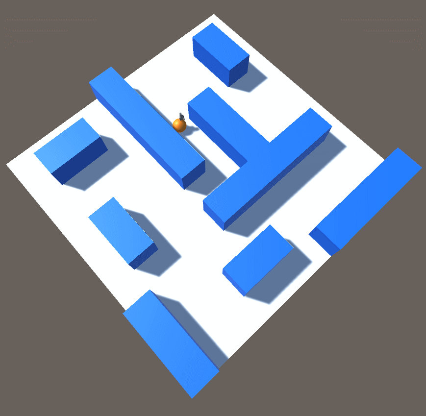

# Click Navigation Project
Unity Version: 2019.3


## Build

### Setup

#### Import Ethan

[Unity Standard Assets](https://assetstore.unity.com/packages/essentials/asset-packs/standard-assets-for-unity-2017-3-32351) to get similar assets to the ones in the book.

Uncheck everything when importing, then check the box for `Standard Assets > Characters > ThirdPersonCharacter`. This will take up less space in your project view.

You can find a model called Ethan.fbx at `Standard Assets > Characters > Models > Ethan.fbx`.
You can find the animation clips at `Standard Assets > Characters > Animation`.
You can find the materials at `Standard Assets > Characters > Materials`

### Step 1: Initialize Environment

* Floor and Obstacles
* Lighting

1. Add a floor plane
2. Add an obstacle cube
3. *Prefab* and name both
4. Give obstacle a color
5. Create an Empty called Environment in Hierarchy
6. Parent both to environment

### Step 2: Set Grid Snapping Settings

At Edit > Grid and Snap 
1. Set *Grid Size* to 1
2. Set *Move* to 1
3. Set *Scale* to 1
4. Set Rotate to 90




### Step 3: Create a Maze

Use the move, scale, and rotate tools to create a maze with the obstacle instances.



### Step 4: Add Ethan

1. Add the *Ethan* model to the maze.
2. Change the material on EthanBody to *EthanGrey*
3. Scale the environment up to (2,2,2) 



### Step 5: Add NavMeshAgent

1. Add *NavMeshAgent* to *Ethan*
2. Select all environment objects and set `Navigation > Object > Navigation Static` to true.
3. Select all obstacles and set *Navigation Area* to "Not Walkable"
4. Open *Navigation* window and Bake
5. Tweak *Agent Radius* to define NavMesh area



### Step 6: Follow Target

1. Add a Sphere called "Target"
2. Give the *Target* a material that contrasts *Obstacle*
3. Add a script to Ethan called Movement.cs

```csharp
using UnityEngine;
using UnityEngine.AI; // Need this for NavMeshAgent

public class Movement : MonoBehaviour
{
    [SerializeField] Transform target; // Get transform of Target
    NavMeshAgent navMeshAgent; // NavMeshAgent Component
    void Awake() // We can use awake to grab references before Start()
    {
        // Get reference to NavMeshAgent
        navMeshAgent = GetComponent<NavMeshAgent>();
    }

    void Update()
    {
        // Every frame update the destination to current target position
        navMeshAgent.destination = target.position;
    }
}
```

4. Attach *Target* to *Movement.cs* on *Ethan*
5. Press Play



### Step 7: Animation

1. Turn off *Apply Root Motion* on Ethan's *Animator*
2. Create a new *Animator Controller* named *Movement* and attach it to *Ethan*
3. Add a new animator parameter called "Speed" of type `float`
4. Create a new **1D Blend Tree** called *Move* in the Animator. Make it dependent on the *Speed* parameter.
5. Add three motions: *HumanoidIdle*, *HumanoidWalk*, *HumanoidRun*
6. Uncheck *Automate Thresholds* in blend tree
7. Use `Compute Thresholds > Velocity Z` to calculate the thresholds based on animation forward velocity.
8. Set `Ethan > NavMeshAgent > Speed` to the highest threshhold value. (5.66 w/ HumanoidRun)
9. In *Movement.cs* set the *Speed* parameter of the animator as the `z` velocity of the player.

```csharp
using UnityEngine;
using UnityEngine.AI;

public class Movement : MonoBehaviour
{
    [SerializeField] Transform target; 
    NavMeshAgent navMeshAgent; 
    Animator animator; // Declare animator as private property
    void Awake()
    {
        navMeshAgent = GetComponent<NavMeshAgent>();
        animator = GetComponent<Animator>(); // Get reference to animator
    }

    void Update()
    {
        navMeshAgent.destination = target.position;
        UpdateAnimator();
    }

    void UpdateAnimator() {
        // Get the velocity of the NavMeshAgent
        Vector3 velocity = navMeshAgent.velocity;

        // Use the velocity to get the component vector in the Z direction
        Vector3 forwardVelocity = Vector3.Scale(velocity, transform.forward);

        // Speed is a scalar. We can get it from the magnitude of the forwardVelocity vector
        float forwardSpeed = forwardVelocity.magnitude;

        // Now we can set the Speed parameter of the Animator
        animator.SetFloat("Speed", forwardSpeed);
    }
}
```



Additionally, Ethan will always follow the *Target* even if it moves.



### Step 8: Click To Move

1. Create a new script called "Control.cs" and attach it to the main camera.
2. Write code that raycasts from the mouse position ont he screen and sets the position of the target to the point where the ray hit.

```csharp
using UnityEngine;

public class Control : MonoBehaviour
{
    [SerializeField] Transform target;
    Camera camera;
    void Awake()
    {
        // Get a reference to the Camera component
        camera = GetComponent<Camera>();
    }

    void Update()
    {
        // Get the point on the screen where the mouse is
        Vector2 mousePosition = Input.mousePosition;

        // Initialize a ray using the ScreenPointToRay method
        Ray cameraRay = camera.ScreenPointToRay(mousePosition);

        // Declare a RaycastHit
        RaycastHit hit;
        
        // Start a raycast and pass in the RaycastHit to get data back
        bool hitSomething = Physics.Raycast(cameraRay, out hit);

        // If the ray did not hit anything, end the function
        if (!hitSomething) return;

        // Set the position of the target to the point where the ray hit
        target.position = hit.point;
    }
}
```

Now the target moves in response to the mouse position, but it moves to any point hit by the ray, including itself. This is problematic and not fun. 

**Trainer Note**: Ask the students to explain why this is happening. It may uncover some gaps in knowledge that should be addressed.


3. Add a new tag to the floor called "Ground".
4. Edit the *Control.cs* script to check if the ray hit an object with the tag "Ground".

```csharp
void Update()
{
    Vector2 mousePosition = Input.mousePosition;
    Ray cameraRay = camera.ScreenPointToRay(mousePosition);
    RaycastHit hit;
    bool hitSomething = Physics.Raycast(cameraRay, out hit);
    if (!hitSomething) return;

    // If we didn't hit the ground, end the function
    if (!hit.collider.CompareTag("Ground")) return;

    target.position = hit.point;
}
```

5. Edit the *Control.cs* script so that the *Target* only moves when the mouse is clicked.

```csharp
void Update()
{
    if (Input.GetM)
    Vector2 mousePosition = Input.mousePosition;
    Ray cameraRay = camera.ScreenPointToRay(mousePosition);
    RaycastHit hit;
    bool hitSomething = Physics.Raycast(cameraRay, out hit);
    if (!hitSomething) return;
    if (!hit.collider.CompareTag("Ground")) return;
    target.position = hit.point;
}
```

### Step 9: Polish

1. Change skybox to solid color
2. Set camera projection to "orthographic"
3. Adjust camera size and position

### Resources

**[Grid Snapping](https://docs.unity3d.com/Manual/GridSnapping.html)**
Set Grid Size to 1 and Increment Settings > Move to 1
